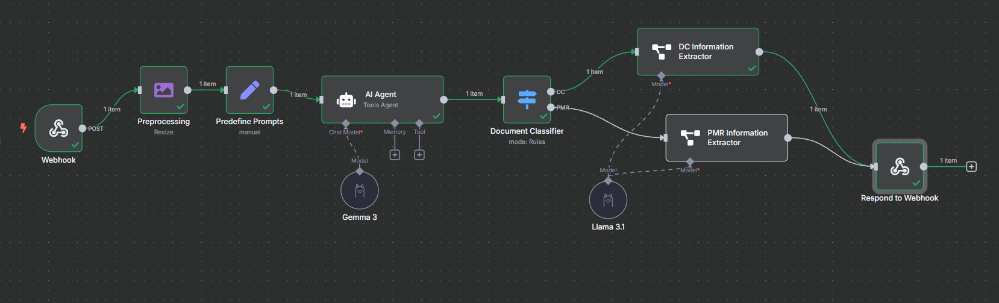

# Validation Pipelines

This folder contains two n8n workflows that form the core of the document validation pipeline for the BinaryBotz-Hack-AI-Thon project, developed for SBI Life to detect fraud in life insurance claims. These workflows process data extracted from Indian IDs (via the `ID Extraction` folder) and non-ID documents (e.g., death certificates, post-mortem reports) to extract and validate information, identifying inconsistencies that may indicate fraudulent claims. The workflows leverage AI models (Gemma 3, Llama 3.1, DeepSeek R1) via Ollama for local processing and integrate with a Neon PostgreSQL database for data storage.

## Folder Structure
- **Document Extraction**: Contains `Document_Information_Extraction.json`, a workflow to extract structured data from non-ID documents.
- **Data Validation**: Contains `Information_Validation.json`, a workflow to validate data across IDs and non-ID documents (in progress).

## Setup Instructions

### 1. Install n8n
n8n is used to automate the workflows for document extraction and validation. Since you’ve installed n8n via npm, here are the steps for reference:
- Ensure Node.js (v16 or later) and npm are installed.
- Install n8n globally:
  ```bash
  npm install -g n8n
  ```
- Start n8n:
  ```bash
  n8n start
  ```
- Access the n8n web interface at `http://localhost:5678`.

For more details, refer to the [n8n installation guide](https://docs.n8n.io/getting-started/installation/).

### 2. Install LLMs via Ollama
The workflows use AI models (Gemma 3, Llama 3.1, DeepSeek R1) for data extraction and validation, running locally via Ollama to ensure data privacy.
- **Install Ollama**:
  - Download and install Ollama from [ollama.ai](https://ollama.ai).
  - Follow the installation instructions for your operating system.
- **Pull the Required Models**:
  - Gemma 3 (used in Document Extraction):
    ```bash
    ollama pull gemma3:12b
    ```
  - Llama 3.1 (used in Document Extraction):
    ```bash
    ollama pull llama3.1:latest
    ```
  - DeepSeek R1 (used in Data Validation):
    ```bash
    ollama pull deepseek-r1:14b-qwen-distill-q4_K_M
    ```
- **Verify Installation**:
  - List installed models:
    ```bash
    ollama list
    ```
  - Ensure `gemma3:12b`, `llama3.1:latest`, and `deepseek-r1:14b-qwen-distill-q4_K_M` are listed.
- **Configure n8n**:
  - In the n8n web interface, add Ollama credentials under `Credentials` > `New` > `Ollama API`.
  - Enter the Ollama host (e.g., `http://localhost:11434`) and test the connection.

### 3. Set Up Neon PostgreSQL (for Data Validation)
The Data Validation workflow queries a Neon PostgreSQL database to store and compare claim data.
- Sign up for a free account at [Neon](https://neon.tech).
- Create a new database and obtain the connection string.
- In n8n, add PostgreSQL credentials under `Credentials` > `New` > `Postgres`.
- Enter the connection string and test the connection.
- Ensure the `claims` table is set up with fields like `claim_id`, `aadhaar_full_name`, `death_certificate_gender`, etc. (schema details are in the workflow).

### 4. Import Workflows into n8n
- **Document Extraction Workflow**:
  - In n8n, go to `Workflows` > `New`.
  - Click the three dots (`...`) and select `Import from File`.
  - Choose `Document Extraction/Document_Information_Extraction.json`.
  - Save the workflow.
- **Data Validation Workflow**:
  - Repeat the process for `Data Validation/Information_Validation.json`.
  - Note: This workflow is in progress and requires enabling the Webhook node (`disabled: false`) before testing.

## Workflows Overview

### Document Extraction Workflow (`Document_Information_Extraction.json`)
- **Purpose**: Extracts structured data from non-ID documents (death certificates, post-mortem reports) to complement ID data for fraud detection.
- **Process**:
  1. Accepts a POST request with a binary image file and `doc_type` (e.g., `death_certificate`, `post_mortem`).
  2. Resizes the image to 896x896 pixels for processing.
  3. Uses a Switch node to route based on document type.
  4. Extracts fields using predefined JSON schemas:
     - Death certificates: `full_name`, `death_date`, `gender`, `cause_of_death`.
     - Post-mortem reports: `full_name`, `gender`, `cause_of_death`, `examination_date`.
  5. Employs AI models via Ollama:
     - Gemma 3 (`gemma3:12b`) for death certificates.
     - Llama 3.1 (`llama3.1:latest`) for both document types.
  6. Outputs a JSON object with extracted fields.
- **Workflow Visualization**:
  Below is a screenshot of the Document Extraction workflow in n8n, showing the nodes for HTTP Request (POST input), image resizing, Switch node for document type routing, AI model nodes (Gemma 3 and Llama 3.1), and the output JSON formatting.

  

- **Sample Input**:
  ```bash
  curl -X POST http://localhost:5678/post-input -F "file=@samples/Death Certificate Test.jpg" -F "doc_type=death_certificate"
  ```
  
- **Sample Output**:
  ```json
  [
  {
    "output": {
      "full_name": "BADARAVADA RAVI KIRAN",
      "gender": "Male",
      "death_date": "30-JAN-2021",
      "death_location": "KRISHNA INSTITUTE OF MEDICAL SCIENCES",
      "parent_father": "KRISHNAM RAJU",
      "parent_mother": "LOKESHWARI",
      "residence_address": "Hno 4-87, Dandiganapudi Village, Nandiwada Mandal, Krishna, Andhra Pradesh-521327",
      "authority_issuer": "Greater Hyderabad Municipal Corporation",
      "region_state": "Telangana State",
      "region_district": "Krishna",
      "registration_number": "1054",
      "registration_date": "12-FEB-2021",
      "certificate_number": "202118001211",
      "certification_date": "15-FEB-2021",
      "certified_by": "Dr. D. Ravinder Goud",
      "certifier_title": "AMOH"
    }
  }
]
  ```
- **Role in Fraud Detection**: Provides structured data from non-ID documents, which is compared with ID data (from the `ID Extraction` folder) to identify inconsistencies (e.g., mismatched names or genders).

### Data Validation Workflow (`Information_Validation.json`)
- **Purpose**: Validates data across Indian IDs (Aadhaar, Voter ID, etc.) and non-ID documents to detect inconsistencies, aiding in fraud detection.
- **Status**: *In progress*. This workflow requires better paid or full-precision models for its complex task of anomaly detection and cross-document validation.
- **Process**:
  1. Accepts a POST request with a `claim_id` to query the `claims` table in Neon PostgreSQL.
  2. Retrieves data (e.g., `aadhaar_full_name`, `death_certificate_gender`) from the database.
  3. Formats and filters fields for comparison.
  4. Compares fields across document pairs (e.g., Aadhaar vs. Voter ID, Aadhaar vs. death certificate) for inconsistencies in `full_name`, `date_of_birth`, `gender`, etc.
  5. Handles special cases like post-mortem identification and marital status conflicts.
  6. Uses DeepSeek R1 (`deepseek-r1:14b-qwen-distill-q4_K_M`) via Ollama for anomaly detection.
  7. Outputs a JSON report detailing inconsistencies.
- **Sample Input** (after enabling the Webhook node):
  ```bash
  curl -X POST http://localhost:5678/demo-api/123 -H "Content-Type: application/json" -d '{"claim_id": "123"}'
  ```
- **Sample Output**:
  ```json
  {
    "aadhaar": {
      "inconsistencies": {
        "voter": [
          {
            "category": "Full names",
            "fields": ["aadhaar_full_name", "voter_full_name"],
            "values": ["John K Doe", "John Kumar Doe"],
            "description": "Full names differ"
          }
        ],
        "death_certificate": [
          {
            "category": "Gender",
            "fields": ["aadhaar_gender", "death_certificate_gender"],
            "values": ["Male", "Female"],
            "description": "Gender mismatch"
          }
        ]
      }
    }
  }
  ```
- **Role in Fraud Detection**: Identifies potential fraud by flagging discrepancies across documents, such as a claim form’s `relation_with_la: Self` conflicting with a death certificate’s `marital_status: Married`.
- **Note on Model Limitations**: The current DeepSeek R1 model (`deepseek-r1:14b-qwen-distill-q4_K_M`) is quantized, which may limit precision for complex anomaly detection. Upgrading to a full-precision or paid model (e.g., a higher-parameter DeepSeek variant) could improve accuracy for this task.

## Integration with FastAPI Backend
The workflows can be integrated with the project’s FastAPI backend to automate the fraud detection pipeline:
- **Document Extraction**:
  - The FastAPI backend (from the `ID Extraction` step) can forward non-ID document images to the workflow’s POST endpoint.
  - Example:
    ```python
    import requests

    def forward_to_document_extraction(image_path, doc_type):
        url = "http://localhost:5678/post-input"
        files = {"file": open(image_path, "rb")}
        data = {"doc_type": doc_type}
        response = requests.post(url, files=files, data=data)
        return response.json()
    ```
- **Data Validation**:
  - After enabling the Webhook node, the FastAPI backend can send a `claim_id` to the workflow to retrieve an inconsistency report.
  - Example:
    ```python
    import requests

    def validate_data(claim_id):
        url = "http://localhost:5678/demo-api/123"
        payload = {"claim_id": str(claim_id)}
        response = requests.post(url, json=payload)
        return response.json()
    ```

## Role in SBI Life Fraud Detection
For SBI Life’s fraud detection pipeline:
- **Document Extraction**: Provides structured data from non-ID documents, complementing ID data extracted in the `ID Extraction` folder.
- **Data Validation**: Compares data across all documents to detect inconsistencies, such as mismatched names, dates, or genders, which may indicate fraudulent claims. The FastAPI backend orchestrates this process, passing data between workflows and storing results for review.

## Privacy and Compliance
- **Local Processing**: All AI models (Gemma 3, Llama 3.1, DeepSeek R1) run locally via Ollama, ensuring data privacy.
- **DPDP Act Compliance**: Sensitive data is processed locally and deleted after use.
- **Data Security**: Neon PostgreSQL ensures secure storage of claim data.

## Next Steps
- Complete the `Data Validation` workflow by upgrading to a full-precision or paid model for improved anomaly detection.
- Add support for additional non-ID document types (e.g., medical reports) in the Document Extraction workflow.
- Enhance FastAPI integration with error handling and logging for production use in SBI Life’s claim processing portal.
- Automate end-to-end testing with sample claims data.
