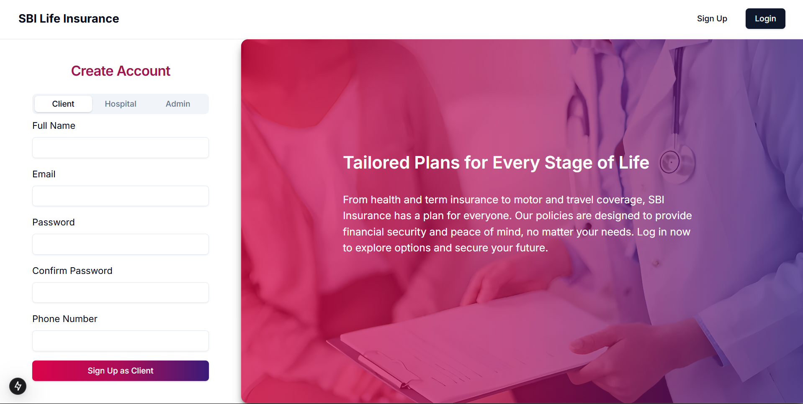
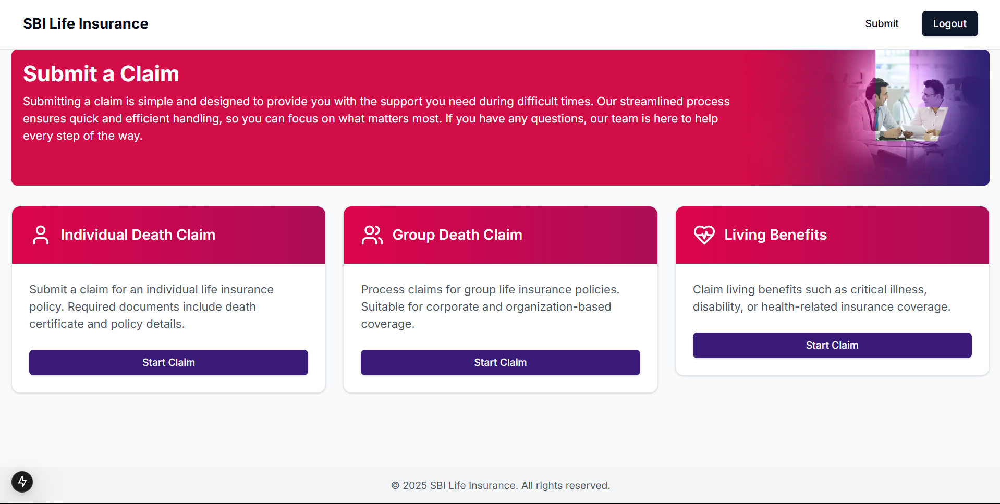
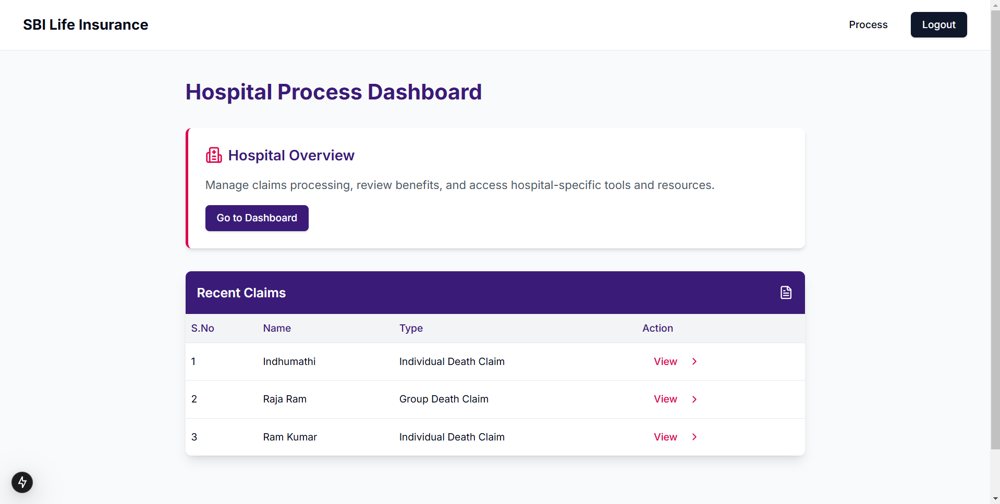
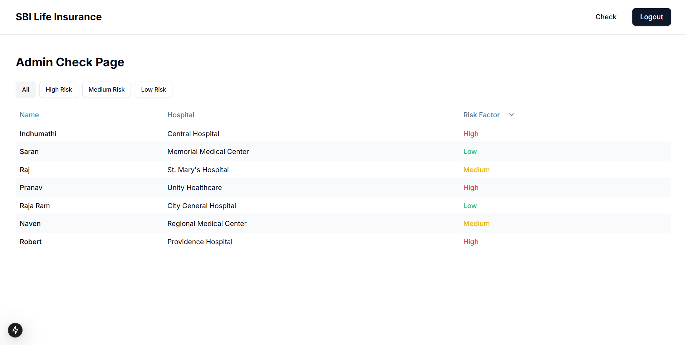

# SBI ID Validation Web Portal

This repository contains the Web Portal for the SBI ID Validation project, developed as part of the BinaryBotz-Hack-AI-Thon for SBI Life. The portal is a Next.js web application designed to validate Indian ID proofs using AI (YOLO V11 model via FastAPI) and provide fraud detection capabilities. It uses Firebase for authentication and data storage, offering role-based access for clients, hospitals, and admins to streamline the claim validation process for life insurance fraud detection.

## Purpose
The SBI ID Validation Web Portal enables secure and efficient validation of Indian ID proofs as part of SBI Life’s fraud detection pipeline. Key features include:
- **Role-Based Access**: Separate dashboards for clients (claimants), hospitals, and admins with tailored functionality.
- **ID Proof Validation**: AI-based validation of uploaded ID documents using YOLO V11 via a FastAPI backend.
- **Fraud Detection Integration**: Integrates with the `Behaviour Analysis` pipeline to provide fraud risk scores and explanations for submitted claims.
- **User Authentication**: Uses Firebase Authentication for secure login and role management.
- **Responsive UI**: Built with Next.js, Tailwind CSS, and custom UI components for a modern, user-friendly experience.

The portal supports SBI Life’s fraud detection workflow by allowing claimants to submit claims, hospitals to upload medical documents, and admins to review fraud detection results, ensuring transparency and efficiency in claim processing.

## Project Structure
- **package.json**: Project dependencies and scripts for the Next.js application.
- **next.config.mjs**, **postcss.config.mjs**, **tailwind.config.mjs**: Configuration files for Next.js, PostCSS, and Tailwind CSS.
- **eslint.config.mjs**: ESLint configuration for code quality.
- **jsconfig.json**: JS/TS path aliases for easier imports.
- **.env.local**: Environment variables (e.g., Firebase and FastAPI configurations, not committed).
- **public/**: Static assets (e.g., SVGs, images) served directly by Next.js.
- **src/**: Main source code for the frontend.
  - **app/**: Next.js app directory for routing, layouts, and pages.
    - `layout.jsx`: Root layout with global providers (e.g., AuthProvider) and navigation.
    - `page.jsx`: Home page for the web portal.
    - Subfolders (`admin-check/`, `client-submit/`, `hospital-process/`, `login/`, `signup/`): Route-specific pages for user roles and flows.
  - **assets/**: Image assets used in the UI (e.g., icons, logos).
  - **components/**: Reusable React components.
    - `Navbar.jsx`: Navigation bar for all pages.
    - `ClaimCard.jsx`: Displays claim details and status.
    - `IDUploader.jsx`: Component for uploading ID documents.
    - `FileViewer.jsx`: Displays uploaded files for review.
    - `contentCarousel.jsx`: Carousel for showcasing features or updates.
    - `ui/`: UI primitives (e.g., buttons, cards, forms).
  - **context/**: React context providers.
    - `AuthContext.jsx`: Manages authentication state and user roles.
  - **lib/**: Utility libraries and configurations.
    - `firebase.js`: Client-side Firebase setup.
    - `firebase-admin.js`: Server-side Firebase Admin SDK setup.

## Setup Instructions
### Prerequisites
- **Node.js**: Version 16+.
- **Firebase Account**: Set up a Firebase project for authentication and Firestore.
- **FastAPI Backend**: Ensure the FastAPI server for ID validation (with YOLO V11) and fraud detection is running (refer to the `Behaviour Analysis` folder for setup).

### Installation
1. **Clone the Repository**:
   ```bash
   git clone https://github.com/logasanjeev/BinaryBotz-Hack-AI-Thon.git
   cd BinaryBotz-Hack-AI-Thon/Web\ Portal
   ```
2. **Install Dependencies**:
   ```bash
   npm install
   ```
3. **Set Up Environment Variables**:
   - Create a `.env.local` file in the root directory.
   - Add the following variables (replace with your Firebase and FastAPI details):
     ```
     NEXT_PUBLIC_FIREBASE_API_KEY=your-firebase-api-key
     NEXT_PUBLIC_FIREBASE_AUTH_DOMAIN=your-firebase-auth-domain
     NEXT_PUBLIC_FIREBASE_PROJECT_ID=your-firebase-project-id
     NEXT_PUBLIC_FIREBASE_STORAGE_BUCKET=your-firebase-storage-bucket
     NEXT_PUBLIC_FIREBASE_MESSAGING_SENDER_ID=your-firebase-messaging-sender-id
     NEXT_PUBLIC_FIREBASE_APP_ID=your-firebase-app-id
     NEXT_PUBLIC_FASTAPI_URL=http://localhost:8000
     ```
   - Obtain Firebase credentials from your Firebase project console.
   - Ensure the FastAPI backend is running at the specified `NEXT_PUBLIC_FASTAPI_URL`.
4. **Run the Development Server**:
   ```bash
   npm run dev
   ```
   - The portal will be available at `http://localhost:3000`.

## Usage
1. **Access the Portal**:
   - Open `http://localhost:3000` in your browser.
2. **Sign Up or Log In**:
   - Navigate to `/signup` to create an account or `/login` to sign in using Firebase Authentication.
   - During signup, select your role (Client, Hospital, or Admin).
3. **Role-Specific Workflows**:
   - **Client (Claimant)**:
     - Navigate to `/client-submit`.
     - Upload ID proofs and claim details using the `IDUploader` component.
     - View claim status and fraud detection results on your dashboard.
   - **Hospital**:
     - Navigate to `/hospital-process`.
     - Upload medical reports and supporting documents.
     - View validation results and claim statuses.
   - **Admin**:
     - Navigate to `/admin-check`.
     - Review submitted claims, fraud detection results (e.g., risk scores, explanations), and validation statuses.
     - Approve or reject claims based on the provided insights.
4. **ID Validation and Fraud Detection**:
   - Uploaded ID proofs are sent to the FastAPI backend for AI-based validation using YOLO V11.
   - Claim data is processed by the `Behaviour Analysis` pipeline to detect fraud, returning a risk score and explanation.

## Screenshots

- 

- 

- 

- 

## Integration with Fraud Detection Pipeline
The Web Portal integrates with the `Behaviour Analysis` and `Document Validation` pipelines:
- **ID Validation**:
  - Uploaded ID proofs are sent to the FastAPI backend (`NEXT_PUBLIC_FASTAPI_URL`) for validation using YOLO V11.
  - Results are stored in Firebase Firestore and displayed to users.
- **Fraud Detection**:
  - Claim data is sent to the `/predict_fraud` endpoint (set up in `Behaviour Analysis`) to receive fraud predictions (risk score, explanation, fraud category).
  - Results are displayed on the respective dashboards (e.g., admin dashboard for review).
- **Document Validation**:
  - Non-ID documents (e.g., medical reports) are processed by the `Document Validation` pipeline to extract information and compute similarity scores.
  - Results are cross-referenced with fraud detection insights to flag discrepancies.

## Dependencies
Key dependencies are listed in `package.json`. Some notable ones include:
- `next`: For the Next.js framework.
- `react`, `react-dom`: Core React libraries.
- `firebase`: For Firebase Authentication and Firestore.
- `tailwindcss`, `postcss`: For styling with Tailwind CSS.
- `@mui/material`: For additional UI components (if used).

To view all dependencies, check the `package.json` file.

## Contact
For issues or questions, please contact the BinaryBotz-Hack-AI-Thon team:
- GitHub: [BinaryBotz-Hack-AI-Thon](https://github.com/binarybotz/hack-ai-thon)
